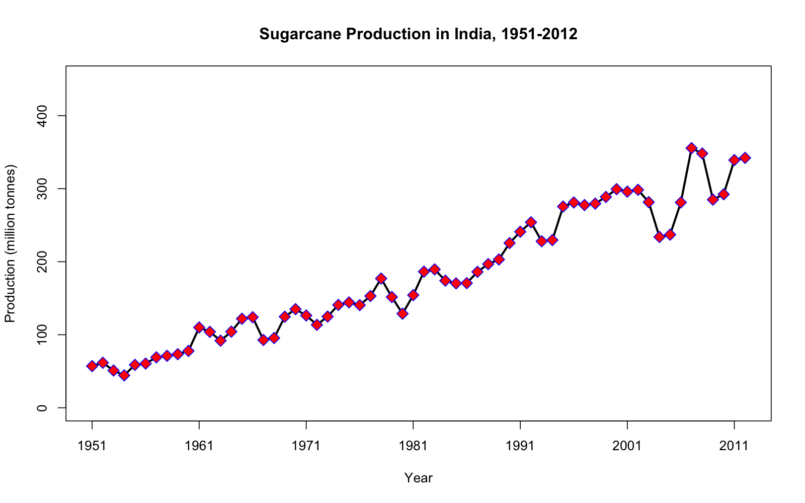
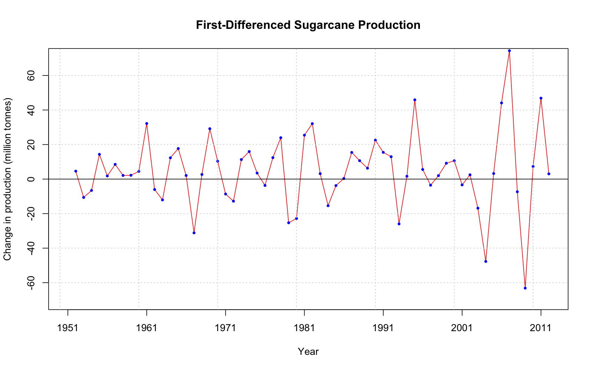
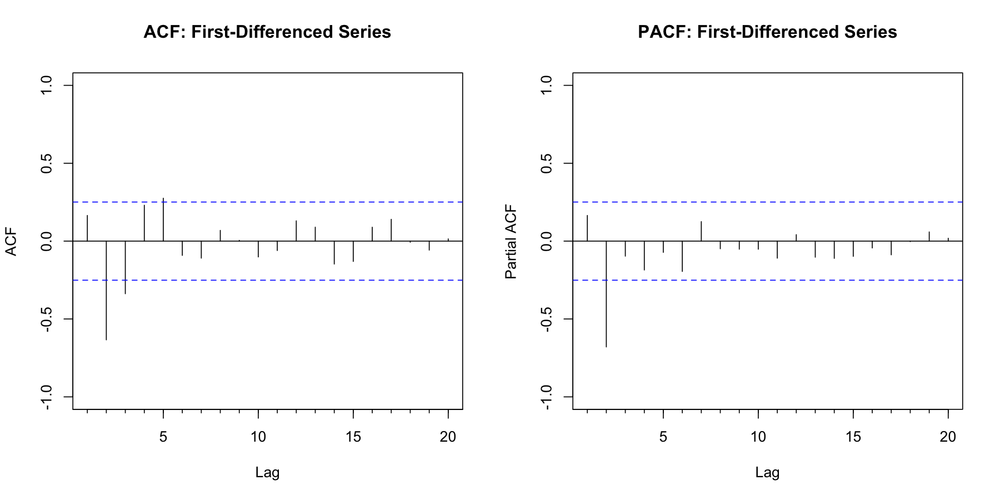
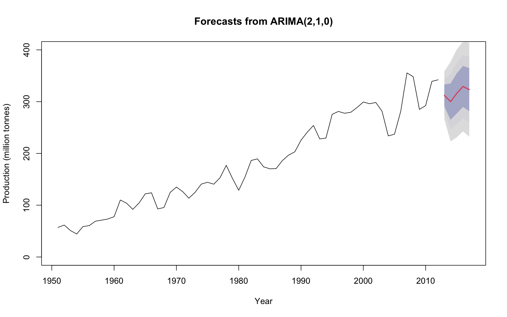
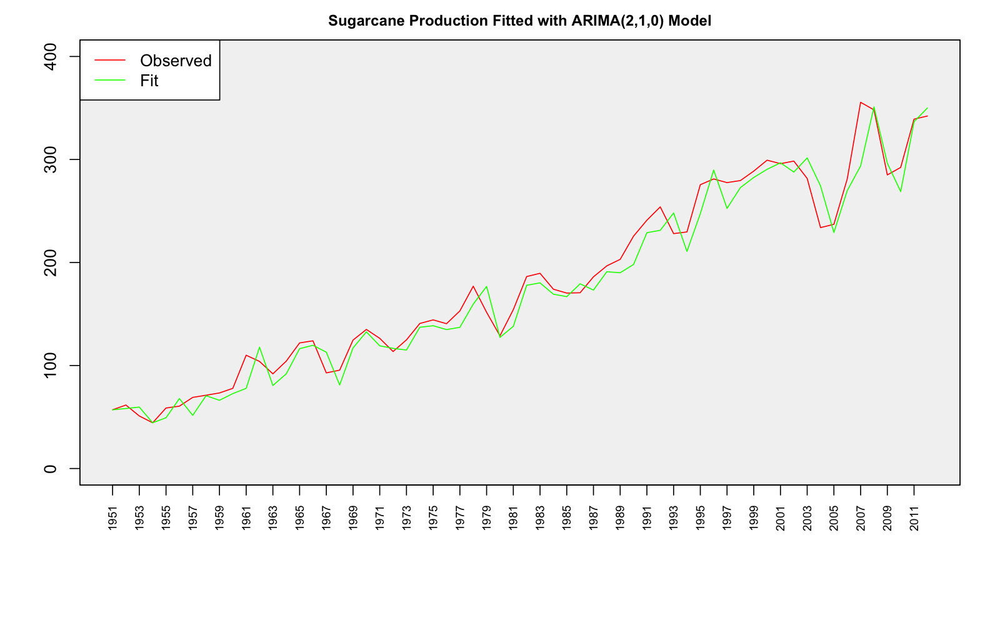
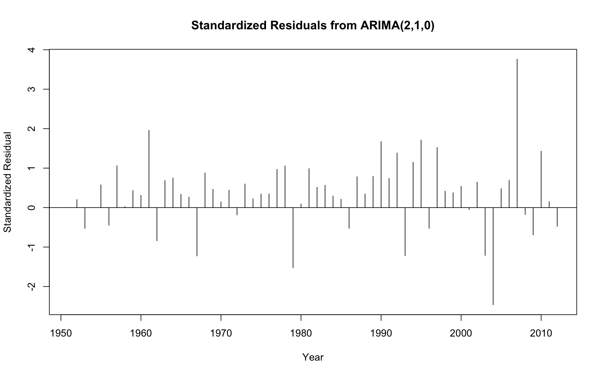
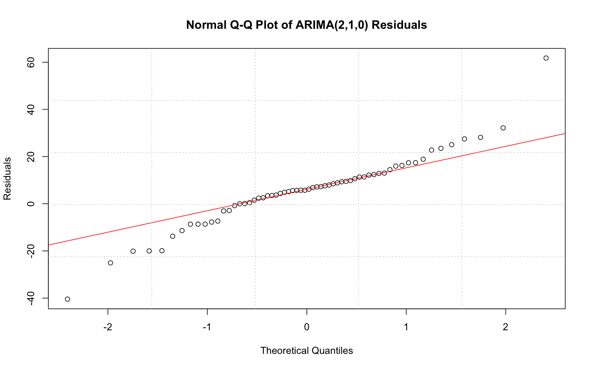
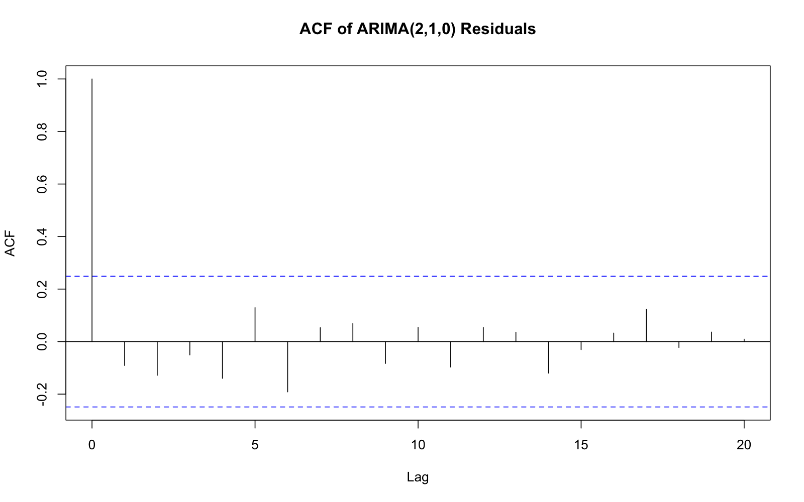
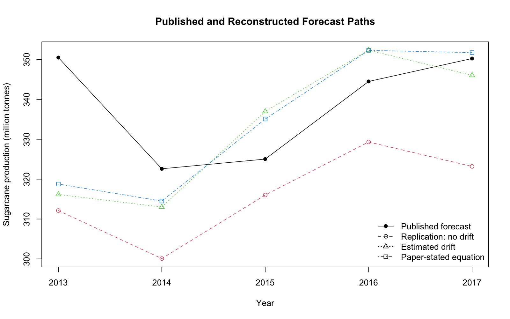

# ARIMA Time-Series Forecasting Replication in R

A replication and reproducibility project based on:

**Kumar, Manoj & Anand, Madhu — “An Application of Time Series ARIMA Forecasting Model for Predicting Sugarcane Production in India.”**

This project reproduces the main ARIMA forecasting workflow using annual sugarcane production data for India from crop years 1950–51 to 2011–12.

The analysis covers data preparation, stationarity testing, model identification, ARIMA estimation and comparison, five-year forecasting, and residual diagnostics.

The original replication was completed as a Financial Time Series project in 2023 and has since been reorganized and documented for reproducibility.

---

## Project Objectives

- Reproduce the original ARIMA forecasting workflow using the published sugarcane-production data.
- Evaluate stationarity, model identification, model selection, forecasting, and residual diagnostics.
- Compare reproduced results with the quantities reported in the original study.
- Audit whether key published statistics can be reconstructed from the reported data and methodology.
- Test a drift specification as a separate extension without altering the original replication.

---

## Key Result

The core replication selects **ARIMA(2,1,0)** among the three original candidate specifications because it has the lowest AIC, AICc, and BIC, while residual diagnostics provide no evidence of significant remaining serial correlation.

The reproducibility audit adds two further findings:

- **Several quantities reported in the original study cannot be reproduced from its published data and stated methodology.** In particular, discrepancies already appear in the autocorrelations of the first-differenced series, before any ARIMA model is estimated.
- **Within the same ARIMA(2,1,0) order, the data favour including drift.** Adding drift improves AIC by approximately **7.29 points** and BIC by approximately **5.18 points**, although it still does not reproduce the published forecast path.

These results separate two questions: whether the original analysis can be reproduced as reported, and whether an alternative specification is better supported by the data.

---

## Data

The dataset contains annual sugarcane production in India for 62 crop years, from 1950–51 to 2011–12, measured in million tonnes.

For the R time-series analysis, each crop year is represented by its ending calendar year:

- 1950–51 → 1951
- 1951–52 → 1952
- ...
- 2011–12 → 2012

The dataset used in the analysis is available in:

[`data/production.csv`](data/production.csv)

### Historical Production Series



The production series shows a strong long-run upward movement, indicating that stationarity should be examined before fitting an ARIMA model.

### First Differencing

The analysis applies first differencing:

$$
\Delta y_t = y_t - y_{t-1}
$$



After differencing, the series fluctuates around a substantially more stable mean.

---

## Methodology

The replication follows a Box–Jenkins ARIMA modelling workflow:

1. Visual inspection of the original production series.
2. Stationarity testing using Augmented Dickey-Fuller (ADF) tests.
3. First differencing of the level series.
4. ACF and PACF analysis to guide model identification.
5. Maximum-likelihood estimation of three candidate models:
   - ARIMA(2,1,0)
   - ARIMA(2,1,1)
   - ARIMA(2,1,2)
6. Model comparison using AIC, AICc, and BIC.
7. Five-step-ahead forecasting for 2013–2017.
8. Residual diagnostics, including:
   - residual plots
   - Q-Q analysis
   - residual ACF/PACF
   - Ljung–Box test
   - Box–Pierce test

The original 2023 coursework used custom unit-root functions supplied as course material. For this public repository, the required procedure was independently implemented in `adf_helpers.R`, reproducing the original project results. The implementation follows three steps:

1. GLS-detrend the series for lag-order selection.
2. Select the number of augmentation lags using BIC.
3. Estimate the final ADF regression by OLS on the original series.

Accordingly, the shorthand `ADF-OLS + BIC` used in the results tables refers to an OLS ADF test whose augmentation lag is selected by BIC on the GLS-detrended series.

An additional ADF test is performed using the `tseries` package as a supplementary stationarity check.

---

## Stationarity Results

The ADF test fails to reject a unit root in the level series but strongly rejects the unit-root null after first differencing. This supports using an integration order of **d = 1**.

| Series | Test | Test Statistic | Lag | 5% Critical Value | Conclusion |
|---|---|---:|---:|---:|---|
| Level | ADF-OLS + BIC | -2.964 | 2 | -3.41 | Fail to reject unit root |
| First difference | ADF-OLS + BIC | -11.694 | 1 | -2.86 | Reject unit root |
| First difference | ADF – `tseries` | -5.299 | 3 | — | Reject unit root, p < 0.01 |

For the level series, the ADF statistic of -2.964 is less negative than the 5% critical value of -3.41, so the unit-root null hypothesis is not rejected.

After first differencing, the ADF statistic falls to -11.694, well below the 5% critical value of -2.86, providing strong evidence against a unit root.

The additional `tseries` ADF test reaches the same conclusion with p < 0.01.

The complete results are available in:

[`results/stationarity_tests.csv`](results/stationarity_tests.csv)

---

## Model Identification and Selection

The ACF and PACF of the first-differenced series were examined to guide model identification.



The PACF contains a particularly strong spike at lag 2, supporting the consideration of two autoregressive terms.

Three candidate specifications were estimated:

- ARIMA(2,1,0)
- ARIMA(2,1,1)
- ARIMA(2,1,2)

All models were estimated using maximum likelihood.

### Model Comparison

| Model | AIC | AICc | BIC |
|---|---:|---:|---:|
| ARIMA(2,1,0) | 519.70 | 520.12 | 526.03 |
| ARIMA(2,1,1) | 521.45 | 522.16 | 529.89 |
| ARIMA(2,1,2) | 523.17 | 524.26 | 533.73 |

ARIMA(2,1,0) has the lowest AIC, AICc, and BIC across all three candidate specifications and is therefore selected as the preferred model.

### Selected Model Estimates

| Parameter | Estimate | Standard Error |
|---|---:|---:|
| AR(1) | 0.3336 | 0.0962 |
| AR(2) | -0.6635 | 0.0964 |

Additional model statistics:

- Estimated innovation variance: 269.6
- Log-likelihood: -256.85
- AIC: 519.70
- AICc: 520.12
- BIC: 526.03

The complete model-comparison results are available in:

[`results/model_comparison.csv`](results/model_comparison.csv)

---

## Forecast Results: 2013–2017

Using the selected ARIMA(2,1,0) model, five-step-ahead forecasts were generated for 2013–2017.



| Year | Point Forecast | 80% Interval | 95% Interval | 99.5% Interval |
|---|---:|---:|---:|---:|
| 2013 | 312.12 | 291.07 – 333.16 | 279.93 – 344.30 | 266.03 – 358.21 |
| 2014 | 300.07 | 265.00 – 335.15 | 246.43 – 353.72 | 223.24 – 376.91 |
| 2015 | 316.01 | 277.27 – 354.75 | 256.77 – 375.26 | 231.16 – 400.87 |
| 2016 | 329.32 | 289.79 – 368.86 | 268.85 – 389.79 | 242.72 – 415.93 |
| 2017 | 323.19 | 281.64 – 364.74 | 259.64 – 386.73 | 232.18 – 414.20 |

The point forecasts remain around 300–330 million tonnes over the forecast horizon, while the prediction intervals widen as uncertainty increases further into the future.

The forecast plot retains the replication's vertical scale of 0–400 million tonnes for consistency with the original study. This means that the upper 99.5% prediction interval is visually clipped for some later forecast years; the complete interval values are reported in the table above.

The full forecast output is available in:

[`results/forecasts_2013_2017.csv`](results/forecasts_2013_2017.csv)

### Observed vs. Fitted Values



The fitted series captures the broad movement of the observed production data while smoothing some of the year-to-year variation.

---

## Residual Diagnostics

Residual diagnostics were used to assess whether the selected ARIMA(2,1,0) model left substantial systematic structure unexplained.

### Standardized Residuals



Residuals were additionally scaled by the estimated innovation standard deviation:

$$
e_t^{*} = \frac{e_t}{\sqrt{\hat{\sigma}^{2}}}
$$

The standardized-residual plot was added during the reproducibility cleanup of the original project. The original 2023 script plotted raw residuals under a "Standardized Residuals" title; the reorganized version distinguishes raw and scaled residuals explicitly.

### Normality Check



The Q-Q plot provides a visual diagnostic of how closely the residual distribution resembles a normal distribution. It is used here as a diagnostic rather than as a formal normality test.

### Residual Autocorrelation



The residual ACF is used to examine whether meaningful serial dependence remains after fitting the model.

Formal residual autocorrelation tests are reported under three specifications:

| Specification | Lag | `fitdf` | Ljung–Box p-value | Box–Pierce p-value |
|---|---:|---:|---:|---:|
| Conventional ARIMA adjustment | 20 | 2 | 0.8397 | 0.9244 |
| Paper-style comparison | 20 | 0 | 0.9110 | 0.9639 |
| Original 2023 coursework | 25 | 5 | 0.8290 | 0.9359 |

The **conventional ARIMA adjustment** uses `fitdf = p + q = 2` for the ARIMA(2,1,0) model and is treated as the primary residual autocorrelation check.

The **paper-style comparison** uses 20 lags without a parameter adjustment. This produces 20 degrees of freedom, matching the degrees of freedom reported in the original paper. However, several combinations of `lag` and `fitdf` can produce 20 degrees of freedom, so the paper's exact diagnostic configuration cannot be identified from the published output alone.

The **original 2023 coursework** used `lag = 25` and `fitdf = 5`. These settings are preserved as a historical replication record rather than as the preferred diagnostic specification.

Twenty lags is relatively high for a sample of 62 annual observations. It is retained in the first two specifications to facilitate comparison with the published analysis rather than because it is uniquely preferred for this sample.

All three specifications lead to the same qualitative conclusion: at conventional significance levels, there is no evidence of significant remaining residual autocorrelation.

Importantly, using the paper-style lag and degrees-of-freedom configuration does not reproduce the paper's reported test statistics exactly. The residual-diagnostic discrepancy therefore cannot be explained by the `lag`/`fitdf` choice alone.

The complete test results are available in:

[`results/residual_autocorrelation_tests.csv`](results/residual_autocorrelation_tests.csv)

---

## Replication Discrepancies in the Published Analysis

The original 2023 project follows the paper's Box-Jenkins workflow and selects ARIMA(2,1,0) from the same candidate model family. During preparation of this public repository, additional checks were performed to determine which published quantities can be reproduced from the reported data and methodology.

### What reproduces

The information-criterion arithmetic in the paper's model-selection table is internally consistent with its own reported log-likelihoods.

For the published ARIMA(2,1,0) result:

| Metric | Published value |
|---|---:|
| Log-likelihood | -257.39 |
| AIC | 520.78 |
| AICc | 521.20 |
| BIC | 527.11 |

The same internal arithmetic consistency holds for the other candidate models. This suggests that the information-criterion calculations themselves are not the source of the replication gap.

### Differenced-series autocorrelations

A discrepancy appears before ARIMA parameter estimation.

Using the observations reported in the paper's data table, the first-differenced series produces autocorrelations that do not exactly match the values reported in the paper's ACF table.

| Lag | Published ACF | Reproduced ACF |
|---:|---:|---:|
| 1 | 0.202 | 0.165 |
| 3 | -0.400 | -0.338 |
| 5 | 0.336 | 0.276 |

Because these quantities are calculated directly from the differenced data, this discrepancy is already present before the ARIMA model is fitted.

### Mean of the differenced series

The paper states that the mean of the first-differenced series is **5.13**.

However, the mean implied directly by the published observations is:

**(342.20 - 57.05) / 61 = 4.6746**

This follows directly from the telescoping sum of the first differences.

For comparison, fitting an AR(2) model to the differenced series with an estimated mean gives approximately **4.4587** under maximum likelihood and **4.5024** under conditional sum of squares. The equivalent ARIMA(2,1,0) drift specification gives the same maximum-likelihood estimate of approximately **4.4587**.

Thus, neither the direct sample mean (**4.6746**) nor these standard estimated-mean specifications yield the stated value of **5.13**.

### ARIMA coefficients

For ARIMA(2,1,0), the paper and this replication produce:

| Parameter | Published | Reproduced |
|---|---:|---:|
| AR(1) | 0.3783 | 0.3336 |
| AR(2) | -0.6652 | -0.6635 |

The second coefficient is very close under the main maximum-likelihood replication, while the first is not reproduced exactly. As an additional robustness check, six standard R estimation routes were examined: maximum likelihood and conditional sum of squares for ARIMA(2,1,0), maximum likelihood and conditional sum of squares for an AR(2) model fitted to the differenced series with a mean, Yule-Walker estimation, and Burg estimation. Across these approaches, the AR(1) estimate ranges from approximately **0.2766 to 0.3389**, below the published value of **0.3783**.

These checks do not rule out every possible historical implementation, but they show that the published coefficient pair is not recovered under several standard R estimation approaches.

### Published forecasting equation

The paper states a differenced-series mean of **5.13** and AR coefficients of **0.3783** and **-0.6652**.

Applying those stated quantities to the final observations in the published dataset produces a 2013 forecast of approximately **318.78**.

The paper reports a 2013 forecast of **350.489**.

Therefore, the published 2013 forecast cannot be recovered directly by applying the paper's stated forecasting equation, coefficients, mean, and published final observations. The discrepancy persists across the multi-year forecast path.

### Residual autocorrelation diagnostics

The paper reports:

- Ljung-Box statistic = 17.6672
- Box-Pierce statistic = 14.8789
- degrees of freedom = 20

The paper discusses residual autocorrelations through lag 20. The published output is therefore most directly consistent with a 20-lag test without an ARMA degrees-of-freedom adjustment, although the exact software call cannot be identified from the published output alone.

Using that specification on the reproduced R residuals gives:

| Test | Reproduced statistic | df | p-value |
|---|---:|---:|---:|
| Ljung-Box | 12.1445 | 20 | 0.9110 |
| Box-Pierce | 10.2230 | 20 | 0.9639 |

Thus, matching the published lag range and reported degrees of freedom does not reproduce the paper's reported residual-test statistics.

The repository separately reports the conventional ARIMA adjustment (`fitdf = p + q = 2`) and preserves the original 2023 coursework setting (`lag = 25`, `fitdf = 5`) for transparency.

### ADF result

The paper reports an ADF statistic of approximately **-5.5395** at lag 3, while the supplementary `tseries::adf.test()` calculation in this repository gives approximately **-5.2988** at lag 3.

Unlike the sample mean or raw autocorrelations, an ADF statistic can depend on the deterministic specification, lag construction, and software implementation. This difference is therefore recorded as an unresolved implementation-sensitive replication discrepancy.

### Interpretation

Several reported quantities cannot be reproduced exactly from the published data and stated methodology, including:

- differenced-series autocorrelations;
- the stated mean of the differenced series;
- the reported ARIMA coefficients;
- residual autocorrelation statistics; and
- the published forecasts.

At the same time, the paper's information-criterion arithmetic is internally consistent with its reported likelihood values.

The source of the remaining differences cannot be determined from the published information alone. However, because some discrepancies are already visible in quantities calculated directly from the published observations, they cannot be attributed solely to software-version or ARIMA-estimation differences.

---

## Extension: Testing a Drift Specification




The core replication above preserves the ARIMA(2,1,0) specification used in the original 2023 project. The following analysis is intentionally treated as a separate extension rather than as a replacement for that replication.

A second ARIMA(2,1,0) model was estimated with a drift term.

| Specification | Drift | Log-likelihood | AIC | AICc | BIC |
|---|---:|---:|---:|---:|---:|
| ARIMA(2,1,0), no drift | — | -256.8503 | 519.7007 | 520.1217 | 526.0333 |
| ARIMA(2,1,0) + drift | 4.4587 | -252.2073 | 512.4146 | 513.1289 | 520.8581 |

Within this same ARIMA order, allowing drift improves:

- AIC by approximately **7.29 points**;
- AICc by approximately **6.99 points**; and
- BIC by approximately **5.18 points**.

The estimated drift is **4.4587 million tonnes per year**, compared with a sample mean first difference of approximately **4.6746 million tonnes**.

This provides evidence that a non-zero trend component is worth considering for these data.

### Does drift explain the published forecast gap?

No.

The five-year forecast path from the drift specification is closer to the forecasts reported in the original paper, but it still does not reproduce them.

| Specification | MAE relative to published forecasts |
|---|---:|
| Replication without drift | 22.4308 |
| Estimated drift model | 13.5848 |
| Paper's stated equation and parameters | 11.8240 |

These MAE values measure distance from the **published forecast path**, not forecast accuracy against subsequently realized production.

The drift model therefore represents a model-specification improvement supported by the information criteria, but it does **not** explain the replication discrepancies documented above.

This distinction is important:

1. **Model specification:** within ARIMA(2,1,0), the data favor including drift.
2. **Replication gap:** the paper's reported forecasts still cannot be reconstructed from its published data, coefficients, stated differenced-series mean, and forecasting equation.

Reproducible extension outputs are saved in:

- `results/drift_model_comparison.csv`
- `results/drift_forecast_comparison.csv`


---

## Repository Structure

```text
arima-sugarcane-replication/
├── LICENSE
├── README.md
├── adf_helpers.R
├── analysis.R
├── drift_extension.R
├── plots.R
├── save_outputs.R
├── data/
│   └── production.csv
├── figures/
│   ├── 01_original_series.png
│   ├── 02_first_difference.png
│   ├── 03_forecast.png
│   ├── 04_observed_vs_fitted.png
│   ├── 05_standardized_residuals.png
│   ├── 06_qq_plot.png
│   ├── 07_residual_acf.png
│   ├── 08_acf_pacf_first_difference.png
│   └── 09_forecast_path_comparison.png
└── results/
    ├── drift_forecast_comparison.csv
    ├── drift_model_comparison.csv
    ├── forecasts_2013_2017.csv
    ├── model_comparison.csv
    ├── residual_autocorrelation_tests.csv
    └── stationarity_tests.csv
```

---

## How to Reproduce

### 1. Clone the repository

```bash
git clone https://github.com/Zahra-Sadeghinejad/arima-sugarcane-forecasting-replication.git
cd arima-sugarcane-forecasting-replication
```

Open the repository folder in R or RStudio and use the repository root as the working directory.

### 2. Install the required packages

```r
install.packages(c("forecast", "tseries"))
```

The replication was rerun using:

- R 4.4.1
- `forecast` 9.0.2
- `tseries` 0.10-60

### 3. Run the statistical analysis

For an interactive run of the analysis in R or RStudio:

```r
source("analysis.R")

# Then run the separate drift extension:
source("drift_extension.R")
```

The first command reproduces the core replication workflow and prints its model estimates, forecasts, and diagnostics. The second command runs the drift extension separately without altering the core replication.

### 4. Reproduce the committed outputs

To regenerate all committed output files — including the six result tables and nine figures — run from the repository root:

```bash
Rscript save_outputs.R
```

`save_outputs.R` runs the full analysis and regenerates the contents of `results/` and `figures/` using relative paths. No user-specific directory paths are required.

A successful run ends with:

```text
Reproducible outputs generated: 6 result tables in results/ and 9 figures in figures/.
```

---

## Skills Demonstrated

- Reproducibility auditing of published statistical results
- Specification testing against a published forecasting model
- Time-series data preparation in R
- Stationarity testing with Augmented Dickey-Fuller tests
- ARIMA model identification using ACF and PACF
- Maximum-likelihood model estimation
- Model comparison using AIC, AICc, and BIC
- Multi-step forecasting with prediction intervals
- Residual and model-diagnostic analysis
- Reproducible analytical workflow
- Automated regeneration of analysis outputs
- Comparison of reproduced and published results
- Documentation of replication discrepancies

---

## Tools

- R
- `forecast`
- `tseries`
- Git / GitHub
- ARIMA / Box–Jenkins modelling
- ADF stationarity testing
- ACF / PACF diagnostics
- Ljung–Box and Box–Pierce tests

---

## License

The original code and documentation in this repository are released under the [MIT License](LICENSE).

The historical sugarcane-production data were reconstructed from values reported in the cited study. The MIT License applies to this repository's original code and documentation, not to rights associated with the original publication or its underlying data.

---

## Attribution

Original study:

> Kumar, Manoj & Anand, Madhu. *An Application of Time Series ARIMA Forecasting Model for Predicting Sugarcane Production in India.*

[View the paper on ResearchGate](https://www.researchgate.net/publication/263505554_An_Application_Of_Time_Series_Arima_Forecasting_Model_For_Predicting_Sugarcane_Production_In_India)

The original article is not redistributed in this repository.

---

## Author

**Zahra Sadeghinejad**  
MSc Economics, University of Amsterdam
